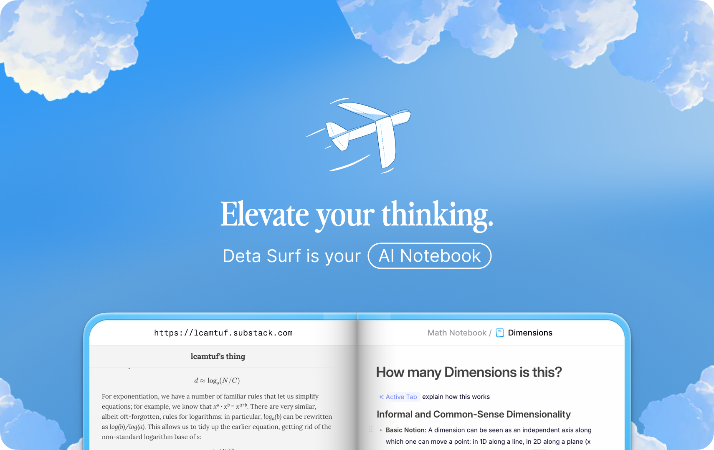
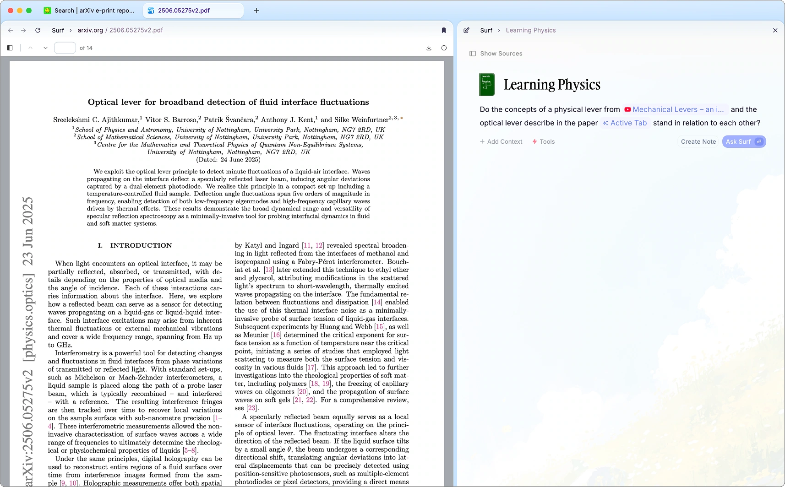
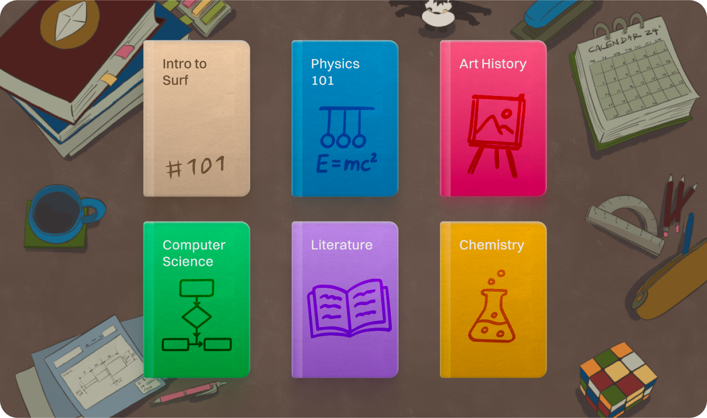
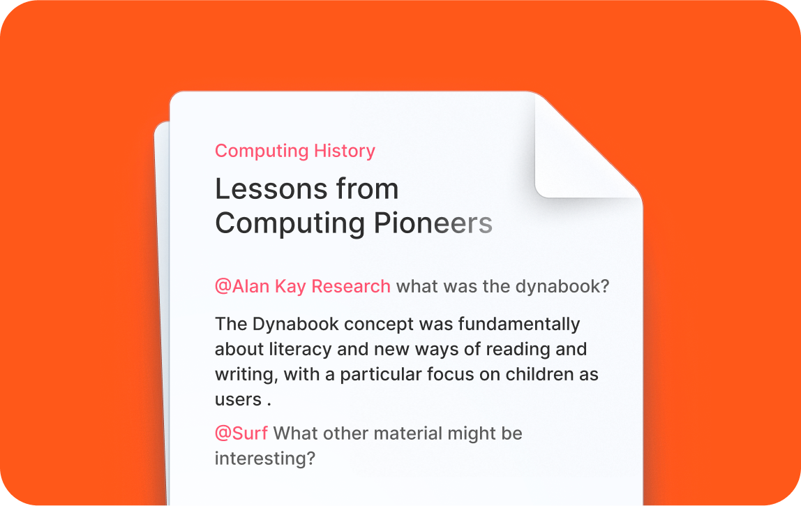
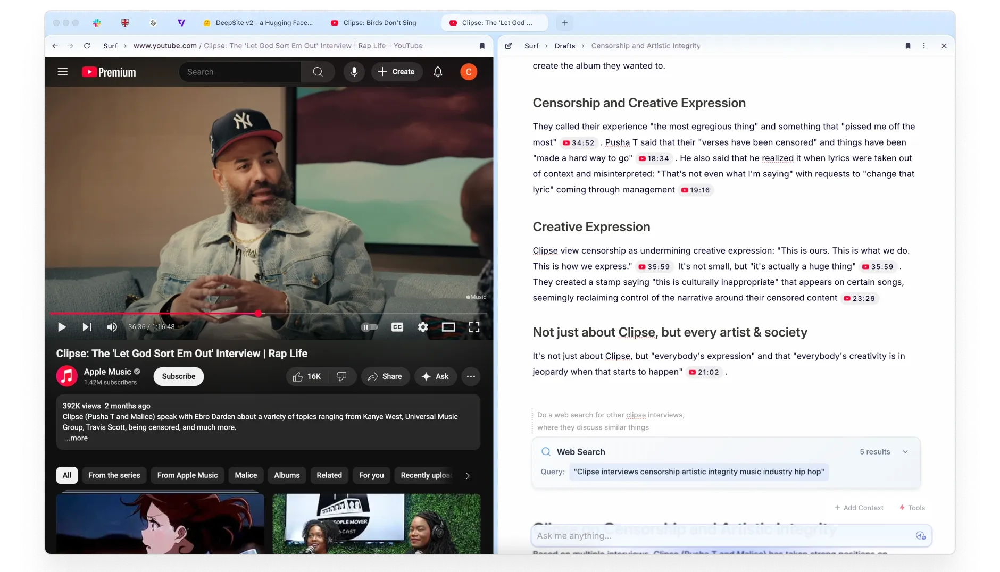
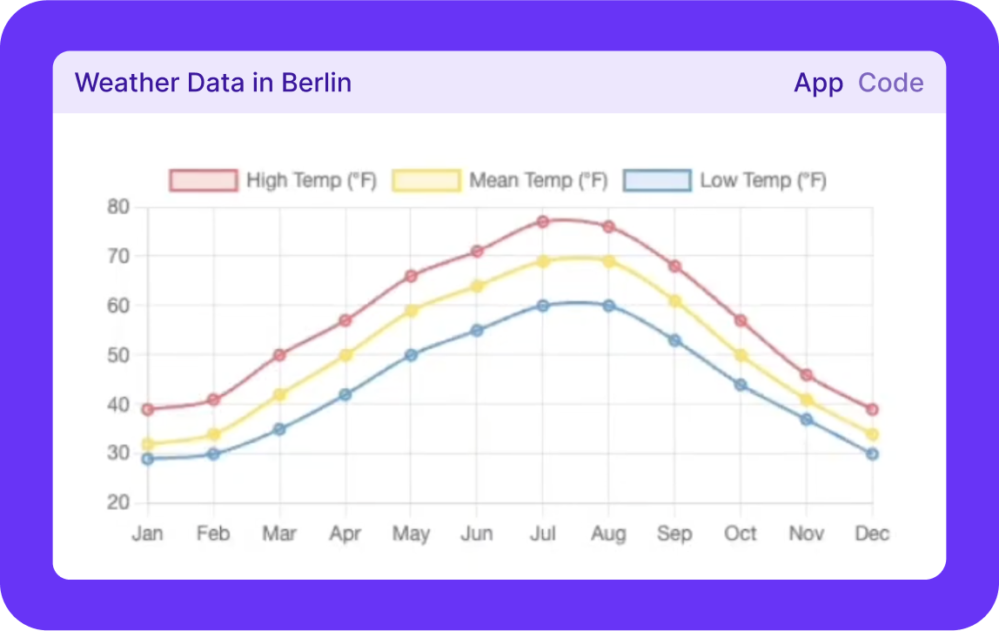
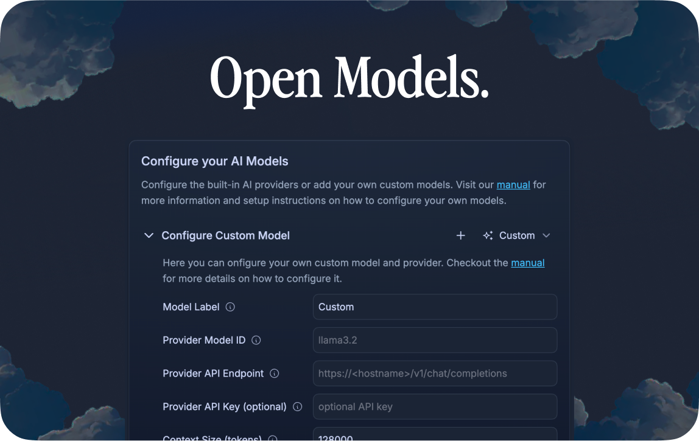

  

[**Website**](https://deta.surf) - [**Discord**](https://deta.surf/discord)

 

# Deta Breakwind: Your AI Notebook

# Deta Surf：你的 AI 笔记本

Deta Breakwind is an AI notebook that brings all your files and the web directly into your stream of thought.
Deta Breakwind 是一款 AI 笔记本，它能将你的所有文件和网页直接带入你的思考流程中。

It's meant for simultaneous research and thinking that minimizes the grunt work: manually searching, opening windows & tabs, scrolling, copying and pasting into a document editor.
它旨在实现同步研究和思考，最大限度地减少繁琐工作：手动搜索、打开窗口和标签页、滚动、复制和粘贴到文档编辑器中。

Breakwind is primarily built in Svelte, TypeScript and Rust, runs on MacOS, Windows & Linux, stores data locally in open formats, and is open source.
Breakwind 主要使用 Svelte、TypeScript 和 Rust 构建，可在 MacOS、Windows 和 Linux 上运行，以开放格式本地存储数据，并且是开源的。

## Motivation

## 项目动机

Most applications are focused on a single task, or a single media type: notes, websites, or PDFs. Real thinking requires juggling media across sources to make connections and synthesize ideas. We want to help people think better, across all their media.
大多数应用程序专注于单一任务或单一媒体类型：笔记、网站或 PDF。真正的思考需要在不同来源的媒体之间切换，以建立联系并综合想法。我们希望帮助人们更好地思考，跨越所有媒体形式。

Breakwind is built to be personal and open, in service of the user. This means local first data, open data formats, open source, and openness with respect to AI models. [Read more](https://deta.surf/motivation).
Breakwind 旨在成为个性化和开放的工具，服务于用户。这意味着优先考虑本地数据、开放数据格式、开源以及对 AI 模型的开放性。[了解更多](https://deta.surf/motivation)。

## 设计目标

- 原生去除广告
- 本地文件保密，支持文件锁
- 支持代码的编辑与运行，防止安全逃逸

## Installation

## 安装

Checkout the [GitHub releases](https://github.com/deta/surf/releases) for the latest stable version of Breakwind for MacOS, Windows and Linux.
请查看 [GitHub 发布页](https://github.com/deta/surf/releases) 获取适用于 MacOS、Windows 和 Linux 的最新稳定版本 Surf。

You can also download Breakwind with some managed & additional features (e.g. AI) from the [Deta website](https://deta.surf). That version is subject to different terms.
您也可以从 [Deta 网站](https://deta.surf) 下载具有一些托管和附加功能（如 AI）的 Surf。该版本受不同条款约束。

For building from source and local development, see [CONTRIBUTING.md](CONTRIBUTING.md).
有关从源代码构建和本地开发的信息，请参阅 [CONTRIBUTING.md](CONTRIBUTING.md)。

## TL;DR - Things to try

## 快速开始 - 尝试以下功能

- _YouTube Notes_: visit a YouTube video and ask a question
- _YouTube 笔记_：访问 YouTube 视频并提问
- _PDF Notes_: open a PDF and ask a question
- _PDF 笔记_：打开 PDF 并提问
- _Create an applet_: use the "app generation" tool and ask for an app
- _创建小程序_：使用"应用生成"工具并请求创建应用
- _Notes that search the web_: use the "web search" tool and ask a question with "search" in it
- _网页搜索笔记_：使用"网页搜索"工具并在问题中包含"search"关键词

## Features

## 功能特性

### Multi-Media Library & Notebooks

### 多媒体库和笔记本

Store almost any media in a private library on your computer, in an open and transparent format.
以开放透明的格式在计算机上的私有库中存储几乎任何类型的媒体。

- Support for local files, sites & links from the web (YouTube, Tweets & more), or create media directly in Breakwind.
- 支持本地文件、网站和网络链接（YouTube、推文等），或直接在 Breakwind 中创建媒体。
- Organize this library into Notebooks.
- 将此库组织到笔记本中。
- Open and use much of your library offline.
- 离线打开和使用库中的大部分内容。
- Use your library to power Breakwind's AI features.
- 使用您的库为 Breakwind 的 AI 功能提供支持。

Breakwind's library is built on a local storage engine called SFFS (Breakwind Flat File System), which stores data in open and transparent formats.
Breakwind 的库建立在名为 SFFS（Surf 扁平文件系统）的本地存储引擎上，该引擎以开放透明的格式存储数据。

[Details on the library](/docs/LIBRARY.md).
[库的详细信息](/docs/LIBRARY.md)。

### Smart Notes

### 智能笔记

Explore and think across your digital stuff without opening up a bunch of windows, clicking, scrolling and copying & pasting into your document (or chatbot).
无需打开一堆窗口、点击、滚动以及复制粘贴到文档（或聊天机器人）中，就能探索和思考您的数字内容。

- `@-mention` and auto-generate from any tab, website or any resource in your [library](./docs/LIBRARY.md).
- 使用 `@提及` 并从任何标签页、网站或 [库](./docs/LIBRARY.md) 中的任何资源自动生成内容。
- Trigger [web searches](./docs/SMART_NOTES.md#web-search) to do research, and bring the results back in your notes.
- 触发 [网络搜索](./docs/SMART_NOTES.md#web-search) 进行研究，并将结果带回您的笔记中。
- Integrated [citations](./docs/SMART_NOTES.md#citations) deeplinked to original sources, whether a section on a webpage, a timestamp in a video, or a page in a PDF.
- 集成 [引用](./docs/SMART_NOTES.md#citations) 功能，深度链接到原始来源，无论是网页上的某个部分、视频中的时间戳还是 PDF 中的页面。
- Generate interactive applications without writing code using [Surflets](./docs/Surflets.md).
- 使用 [Surflets](./docs/Surflets.md) 无需编写代码即可生成交互式应用程序。
- Paste in images, tables or data from other applications and have Breakwind understand and incorporate them.
- 粘贴来自其他应用程序的图像、表格或数据，Surf 能够理解并整合它们。
- Use rich formating, code blocks, to-do lists and more in your notes.
- 在笔记中使用丰富的格式、代码块、待办事项列表等功能。

[Read more](/docs/SMART_NOTES.md).
[了解更多](/docs/SMART_NOTES.md)。

### Tabs, Split View & Sidebar

### 标签页、分屏视图和侧边栏

Breakwind is built around tabs, split view and a sidebar for easy navigation.
Breakwind 围绕标签页、分屏视图和侧边栏构建，便于导航。

- Open local notes, files or web pages in tabs.
- 在标签页中打开本地笔记、文件或网页。
- Split view allows you to view and interact with multiple resources side by side.
- 分屏视图允许您并排查看和交互多个资源。
- The sidebar provides quick access to your Notebooks & notes.
- 侧边栏提供对笔记本和笔记的快速访问。

### Surflets (App Generation)

### Surflets（应用生成）

Breakwind can code interactive applets to help you visualize, understand or explore concepts or data that are aided with code.
Breakwind 可以编写交互式小程序，帮助您可视化、理解或探索需要代码辅助的概念或数据。

[Read more](./docs/SURFLETS.md).
[了解更多](./docs/SURFLETS.md)。

### AI

### 人工智能

[Breakwind's notes](./docs/SMART_NOTES.md) and [Surflets](./docs/SURFLETS.md) are powered by large language models of your choice.
[Breakwind 的笔记](./docs/SMART_NOTES.md) 和 [Surflets](./docs/SURFLETS.md) 由您选择的大型语言模型提供支持。

- Bring your own key for popular models
- 为流行模型提供您自己的密钥
- Add a cloud model
- 添加云端模型
- Use Local Language Models
- 使用本地语言模型

[Read more](./docs/AI_MODELS.md).
[了解更多](./docs/AI_MODELS.md)。

### Shortcuts

### 快捷键

Find the most common shortcuts [here](./docs/SHORTCUTS.md).
在[这里](./docs/SHORTCUTS.md)找到最常用的快捷键。

## Security

## 安全

_To report a security concern, please see_ https://github.com/deta/surf/security/policy
_报告安全问题，请访问_ https://github.com/deta/surf/security/policy

## Contributing

## 贡献

See [CONTRIBUTING.md](CONTRIBUTING.md) for details on contributing to the project and an overview of the codebase.
有关如何为项目做出贡献以及代码库概述的详细信息，请参阅 [CONTRIBUTING.md](CONTRIBUTING.md)。

## Code of Conduct

## 行为准则

See [CODE_OF_CONDUCT.md](CODE_OF_CONDUCT.md) for details on our code of conduct.
有关我们行为准则的详细信息，请参阅 [CODE_OF_CONDUCT.md](CODE_OF_CONDUCT.md)。

## License

## 许可证

The source code for this project is licensed under the Apache 2.0 license, with the following exceptions:
本项目的源代码采用 Apache 2.0 许可证授权，但有以下例外：

1. Our patch for the @ghostery/adblocker-electron package is licensed under the Mozilla Public License 2.0 (MPL-2.0), consistent with the upstream project's licensing.
1. 我们为 @ghostery/adblocker-electron 包提供的补丁采用 Mozilla Public License 2.0 (MPL-2.0) 许可证，与上游项目的许可证保持一致。
1. Select files may contain their own specific license headers that override the default license.
1. 部分文件可能包含特定的许可证头信息，这些信息优先于默认许可证。

Unless otherwise specified in the file or directory, all code defaults to the Apache 2.0 license.
除非在文件或目录中另有说明，否则所有代码默认为 Apache 2.0 许可证。

See [LICENSE](LICENSE) for more details about the Apache 2.0 license.
有关 Apache 2.0 许可证的更多详细信息，请参阅 [LICENSE](LICENSE)。

**Note:** The Deta name and logos are trademarks of Deta GmbH and are **not** covered by the Apache 2.0 license.
**注意：** Deta 名称和标志是 Deta GmbH 的商标，不受 Apache 2.0 许可证保护。

Deta GmbH is a commercial open source company. Breakwind is designed to operate as open source software without needing Deta's servers. Deta GmbH also offers a modified version of Breakwind (which integrates with Deta's servers) and is subject to separate terms and conditions. This version of Breakwind can be downloaded from the [Deta website](https://deta.surf/).
Deta GmbH 是一家商业开源公司。Surf 设计为开源软件，无需 Deta 的服务器即可运行。Deta GmbH 还提供 Breakwind 的修改版本（与 Deta 的服务器集成），受单独的条款和条件约束。您可以从 [Deta 网站](https://deta.surf/) 下载该版本的 Surf。

## Acknowledgements

## 致谢

This project makes use of the following open source packages (not a comprehensive list):
本项目使用了以下开源软件包（非完整列表）：

- [Electron](https://www.electronjs.org/)
- [Electron](https://www.electronjs.org/)
- [Tiptap](https://tiptap.dev/)
- [Tiptap](https://tiptap.dev/)
- [Svelte](https://svelte.dev/)
- [Svelte](https://svelte.dev/)
- [Rust](https://www.rust-lang.org/)
- [Rust](https://www.rust-lang.org/)
