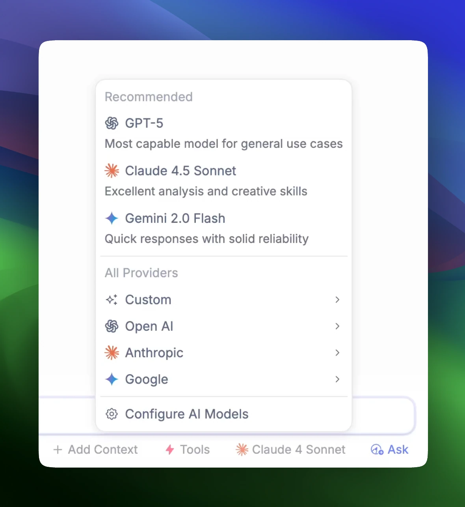
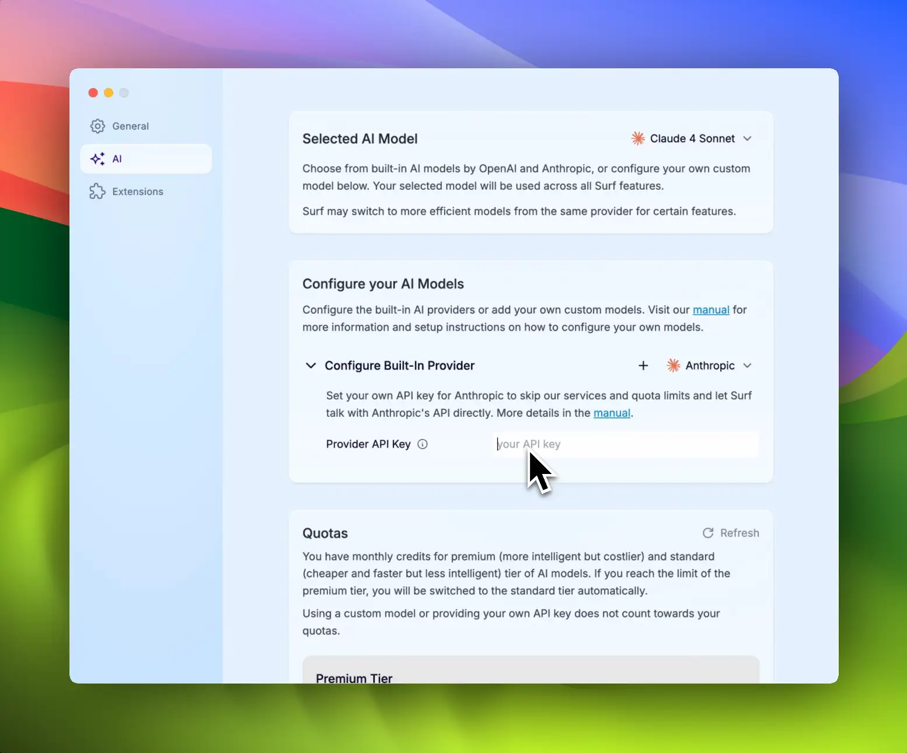
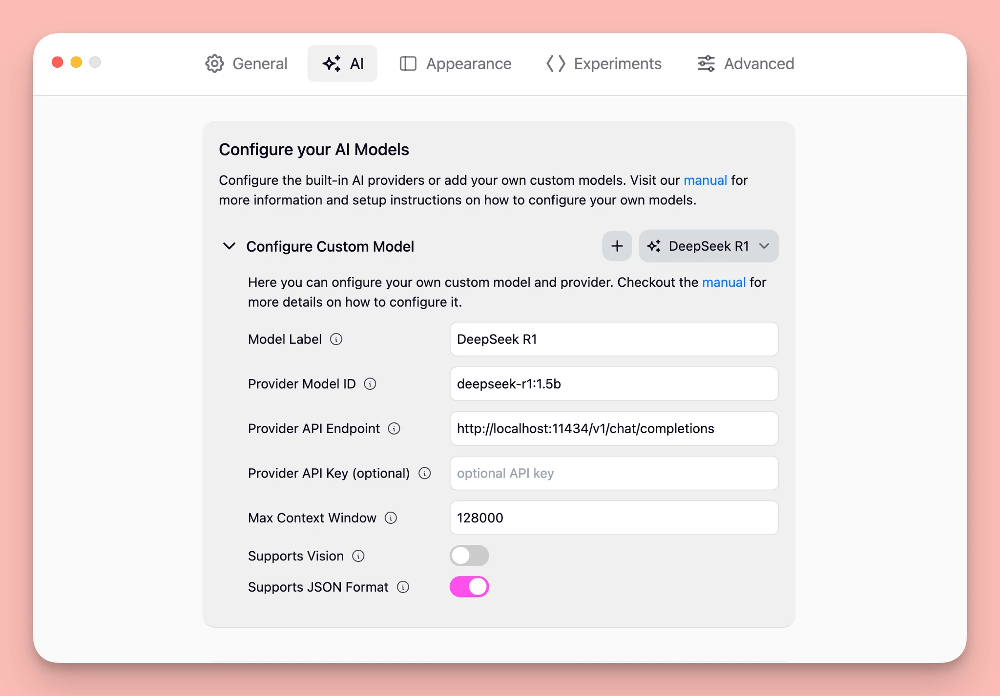

## AI Models in Breakwind

## Breakwind 中的 AI 模型

---

We believe the use of AI models in Breakwind should be open.
我们认为 Breakwind 中 AI 模型的使用应当是开放的。

We've built a UI to switch between models on every query. We have architected Breakwind so that you can bring your own key for popular models or add your own custom model (either local or in the cloud).
我们构建了一个用户界面，可以在每次查询时切换模型。我们设计了 Breakwind 的架构，使您可以为流行模型提供自己的密钥，或者添加自己的自定义模型（本地或云端）。

Once added, your model will show up in the UI.
添加后，您的模型将显示在用户界面中。

## Switching Models in Breakwind

## 在 Breakwind 中切换模型

---

Breakwind's interface allows you to easily switch between models on the fly and use the one that best fits your needs. Just select it in the switcher.
Breakwind 的界面允许您随时轻松切换模型，使用最适合您需求的模型。只需在切换器中选择即可。

## Configuring the Built-In Models

## 配置内置模型

---

You can enter your own API key by going to Preferences → AI and then selecting one of the built-in providers under "Configure your AI Models".
您可以通过转到 Preferences → AI，然后在 "Configure your AI Models" 下选择一个内置提供商来输入自己的 API 密钥。

Read [OpenAI's](https://help.openai.com/en/articles/4936850-where-do-i-find-my-openai-api-key) help page or visit [Anthropic's Claud Console](https://console.anthropic.com/settings/keys) for your API keys.
请阅读 [OpenAI 的](https://help.openai.com/en/articles/4936850-where-do-i-find-my-openai-api-key) 帮助页面或访问 [Anthropic 的 Claud Console](https://console.anthropic.com/settings/keys) 获取您的 API 密钥。

## Adding Your Own Model to Breakwind

## 向 Breakwind 添加您自己的模型

---

If you have not yet setup your own AI model, follow the instructions for some [**common providers**](#common-providers) below. Once you have your model running, you can add it to Breakwind by following these steps:
如果您尚未设置自己的 AI 模型，请按照以下一些 [**常见提供商**](#common-providers) 的说明操作。一旦您的模型运行起来，您可以按照以下步骤将其添加到 Breakwind 中：

1. Open the Breakwind settings through the app menu or using the shortcut `⌘/ctrl + ,`
1. 通过应用程序菜单或使用快捷键 `⌘/ctrl + ,` 打开 Breakwind 设置
1. Navigate to the "AI" tab.
1. 导航到 "AI" 选项卡
1. Click on the "Add Model" button under the "Configure your AI Models" section.
1. 点击 "Configure your AI Models" 部分下的 "Add Model" 按钮
1. Give your model a name and most importantly, provide the URL where your model is hosted and the ID of the model itself.
1. 为您的模型命名，最重要的是，提供托管您模型的 URL 以及模型本身的 ID

The model URL should be the OpenAI compatible chat completions API endpoint where your model is hosted. The model ID is the unique identifier of your model. If your model requires an API key, you can provide it in the settings as well.
模型 URL 应该是托管您模型的 OpenAI 兼容的聊天补全 API 端点。模型 ID 是您模型的唯一标识符。如果您的模型需要 API 密钥，您也可以在设置中提供。

See below on what each configuration option means, you can usually find the required information in the documentation of your chosen provider.
请参阅下面每个配置选项的含义，您通常可以在所选提供商的文档中找到所需信息。

Once you have added your model, you can start using it in Breakwind. Select it from the dropdown at the top of the settings page or from the Chat or Smart Notes editor.
添加模型后，您可以开始在 Breakwind 中使用它。从设置页面顶部的下拉菜单或从 Chat 或 Smart Notes 编辑器中选择它。

## Configuration Options

## 配置选项

---

Here is a list of the configuration options you can set when adding a new model to Breakwind:
以下是添加新模型到 Breakwind 时可以设置的配置选项列表：

| **Option**      | **Value**                                                                                                                                 |
| --------------- | ----------------------------------------------------------------------------------------------------------------------------------------- |
| Provider URL    | Full URL of the model provider's OpenAI compatible API endpoint, most likely follows this format `https://<hostname>/v1/chat/completions` |
| Model ID        | The unique identifier or name of the model provided by the model provider                                                                 |
| API Key         | If the model provider requires an API key, provide it here                                                                                |
| Context Size    | The maximum number of tokens for the context window, can usually be found in your provider's documentation                                |
| Supports Vision | Whether the model supports vision tasks, check the provider's documentation                                                               |
| Supports JSON   | Whether the model supports JSON output format, smaller or local models usually don't                                                      |

| **选项**        | **值**                                                                                                 |
| --------------- | ------------------------------------------------------------------------------------------------------ |
| Provider URL    | 模型提供商的 OpenAI 兼容 API 端点的完整 URL，很可能遵循此格式 `https://<hostname>/v1/chat/completions` |
| Model ID        | 模型提供商提供的模型的唯一标识符或名称                                                                 |
| API Key         | 如果模型提供商需要 API 密钥，请在此处提供                                                              |
| Context Size    | 上下文窗口的最大令牌数，通常可以在提供商的文档中找到                                                   |
| Supports Vision | 模型是否支持视觉任务，请查看提供商的文档                                                               |
| Supports JSON   | 模型是否支持 JSON 输出格式，较小的模型或本地模型通常不支持                                             |

## Common Providers

## 常见提供商

---

### **Ollama - Local**

### **Ollama - 本地**

To use AI models running locally on your machine we recommend using [Ollama](https://ollama.com/). To get started follow their [quick start guide](https://github.com/ollama/ollama/blob/main/README.md#quickstart) to set it up locally and then use the following configuration options:
要使用在您计算机上本地运行的 AI 模型，我们推荐使用 [Ollama](https://ollama.com/)。首先，按照他们的 [快速入门指南](https://github.com/ollama/ollama/blob/main/README.md#quickstart) 在本地设置它，然后使用以下配置选项：

| **Option**      | **Value**                                                                                                       |
| --------------- | --------------------------------------------------------------------------------------------------------------- |
| Provider URL    | `http://localhost:11434/v1/chat/completions`                                                                    |
| Model ID        | The model name provided by Ollama, check their [model page](https://ollama.com/search) for all available models |
| API Key         | Can be left blank                                                                                               |
| Context Size    | run `ollama show <model name>` to see the context window size of your Ollama model                              |
| Supports Vision | Whether the model supports vision tasks, check the [model page](https://ollama.com/search) for more info        |
| Supports JSON   | for local models it's best to disable this                                                                      |

| **选项**        | **值**                                                                                     |
| --------------- | ------------------------------------------------------------------------------------------ |
| Provider URL    | `http://localhost:11434/v1/chat/completions`                                               |
| Model ID        | Ollama 提供的模型名称，请查看他们的 [模型页面](https://ollama.com/search) 了解所有可用模型 |
| API Key         | 可以留空                                                                                   |
| Context Size    | 运行 `ollama show <model name>` 查看您的 Ollama 模型的上下文窗口大小                       |
| Supports Vision | 模型是否支持视觉任务，请查看 [模型页面](https://ollama.com/search) 获取更多信息            |
| Supports JSON   | 对于本地模型，最好禁用此选项                                                               |

### OpenRouter - Hosted

### OpenRouter - 托管

To use models hosted by [OpenRouter](https://openrouter.ai/) first create an account, then generate an API key from their [settings page](https://openrouter.ai/settings/keys). Use the following configuration options to connect it to Breakwind:
要使用由 [OpenRouter](https://openrouter.ai/) 托管的模型，请首先创建一个账户，然后从他们的 [设置页面](https://openrouter.ai/settings/keys) 生成 API 密钥。使用以下配置选项将其连接到 Breakwind：

| **Option**      | **Value**                                                                                                                 |
| --------------- | ------------------------------------------------------------------------------------------------------------------------- |
| Provider URL    | `https://openrouter.ai/api/v1/chat/completions`                                                                           |
| Model ID        | The model ID provided by OpenRouter, check their [**models page**](https://openrouter.ai/models) for all available models |
| API Key         | Your OpenRouter API key                                                                                                   |
| Context Size    | The maximum number of tokens for the context window                                                                       |
| Supports Vision | Whether the model supports vision tasks, check the [model page](https://openrouter.ai/models) for more info               |
| Supports JSON   | Whether the model supports a JSON output forma, smaller models usually don't                                              |

| **选项**        | **值**                                                                                               |
| --------------- | ---------------------------------------------------------------------------------------------------- |
| Provider URL    | `https://openrouter.ai/api/v1/chat/completions`                                                      |
| Model ID        | OpenRouter 提供的模型 ID，请查看他们的 [**模型页面**](https://openrouter.ai/models) 了解所有可用模型 |
| API Key         | 您的 OpenRouter API 密钥                                                                             |
| Context Size    | 上下文窗口的最大令牌数                                                                               |
| Supports Vision | 模型是否支持视觉任务，请查看 [模型页面](https://openrouter.ai/models) 获取更多信息                   |
| Supports JSON   | 模型是否支持 JSON 输出格式，较小的模型通常不支持                                                     |

### Hugging Face (via Inference Providers) - Hosted

### Hugging Face (通过推理提供商) - 托管

To use text generation models from [**Hugging Face**](https://huggingface.co/) you can use their routing service with one of their supported [**Inference Providers**](https://huggingface.co/blog/inference-providers) like [**Together AI**](https://together.ai).
要使用来自 [**Hugging Face**](https://huggingface.co/) 的文本生成模型，您可以使用他们的路由服务和其中一个受支持的 [**推理提供商**](https://huggingface.co/blog/inference-providers)，如 [**Together AI**](https://together.ai)。

As an example here's how to use a Hugging Face model running on Together AI via Hugging Face:
以下是如何通过 Hugging Face 使用在 Together AI 上运行的 Hugging Face 模型的示例：

1. Sign up to Hugging Face if you haven't
1. 如果您还没有，请注册 Hugging Face 账号
1. Generate a [Access Token](https://huggingface.co/settings/tokens) in the Hugging Face settings
1. 在 Hugging Face 设置中生成 [访问令牌](https://huggingface.co/settings/tokens)
1. Select a model from [Hugging Face's model page](https://huggingface.co/models?inference_provider=together&sort=trending) that supports Together AI as the Inference Provider and copy its ID (e.g. [DeepSeek R1](https://huggingface.co/deepseek-ai/DeepSeek-R1))
1. 从 [Hugging Face 的模型页面](https://huggingface.co/models?inference_provider=together&sort=trending) 中选择一个支持 Together AI 作为推理提供商的模型，并复制其 ID（例如 [DeepSeek R1](https://huggingface.co/deepseek-ai/DeepSeek-R1)）
1. Add a new model in Breakwind's AI settings and configure it like below:
1. 在 Breakwind 的 AI 设置中添加新模型，并按照以下方式配置：

| **Option**      | **Value**                                                                                                                                                          |
| --------------- | ------------------------------------------------------------------------------------------------------------------------------------------------------------------ |
| Provider URL    | `https://router.huggingface.co/together/v1/chat/completions`                                                                                                       |
| Model ID        | The model ID provided by Hugging Face, check their [**models page**](https://huggingface.co/models?inference_provider=together&sort=trending) for available models |
| API Key         | Your Hugging Face Access Token                                                                                                                                     |
| Context Size    | The maximum number of tokens for the context window, check the model page                                                                                          |
| Supports Vision | Whether the model supports vision tasks, check the model page                                                                                                      |
| Supports JSON   | Whether the model supports a JSON output format, smaller models usually don't                                                                                      |

| **选项**        | **值**                                                                                                                                        |
| --------------- | --------------------------------------------------------------------------------------------------------------------------------------------- |
| Provider URL    | `https://router.huggingface.co/together/v1/chat/completions`                                                                                  |
| Model ID        | Hugging Face 提供的模型 ID，请查看他们的 [**模型页面**](https://huggingface.co/models?inference_provider=together&sort=trending) 了解可用模型 |
| API Key         | 您的 Hugging Face 访问令牌                                                                                                                    |
| Context Size    | 上下文窗口的最大令牌数，请查看模型页面                                                                                                        |
| Supports Vision | 模型是否支持视觉任务，请查看模型页面                                                                                                          |
| Supports JSON   | 模型是否支持 JSON 输出格式，较小的模型通常不支持                                                                                              |

### Hugging Face (via your own Inference Endpoint) - Hosted

### Hugging Face (通过您自己的推理端点) - 托管

You can also deploy your own [Inference Endpoint](https://endpoints.huggingface.co/) on Hugging Face and use that with Breakwind. First checkout their [guide on ho to create OpenAI compatible inference endpoint](https://huggingface.co/blog/tgi-messages-api) then add a new model in Breakwind's AI settings and configure it like below:
您也可以在 Hugging Face 上部署自己的 [推理端点](https://endpoints.huggingface.co/) 并将其与 Breakwind 一起使用。首先查看他们的 [关于如何创建兼容 OpenAI 的推理端点的指南](https://huggingface.co/blog/tgi-messages-api)，然后在 Breakwind 的 AI 设置中添加新模型，并按照以下方式配置：

| **Option**      | **Value**                                                                                                                                                      |
| --------------- | -------------------------------------------------------------------------------------------------------------------------------------------------------------- |
| Provider URL    | `https://api-inference.huggingface.co/models/`                                                                                                                 |
| Model ID        | The model ID provided by Hugging Face, check their [models page](https://huggingface.co/models?inference_provider=together&sort=trending) for available models |
| API Key         | Your Hugging Face Access Token                                                                                                                                 |
| Context Size    | The maximum number of tokens for the context window, check the model page                                                                                      |
| Supports Vision | Whether the model supports vision tasks, check the model page                                                                                                  |
| Supports JSON   | Whether the model supports a JSON output forma, smaller models usually don't                                                                                   |

| **选项**        | **值**                                                                                                                                    |
| --------------- | ----------------------------------------------------------------------------------------------------------------------------------------- |
| Provider URL    | `https://api-inference.huggingface.co/models/`                                                                                            |
| Model ID        | Hugging Face 提供的模型 ID，请查看他们的 [模型页面](https://huggingface.co/models?inference_provider=together&sort=trending) 了解可用模型 |
| API Key         | 您的 Hugging Face 访问令牌                                                                                                                |
| Context Size    | 上下文窗口的最大令牌数，请查看模型页面                                                                                                    |
| Supports Vision | 模型是否支持视觉任务，请查看模型页面                                                                                                      |
| Supports JSON   | 模型是否支持 JSON 输出格式，较小的模型通常不支持                                                                                          |

### Other Providers

### 其他提供商

In theory any provider that offers a OpenAI compatible chat completions API should work with Breakwind. In practice some providers are not fully compatible and can come with their own quirks. The only way to know for sure if a given provider works is by trying it out. Refer to the [Configuration Options](https://www.notion.so/Configuration-Options-199a5244a717800081a7ce12cef7bd93?pvs=21) above on what information is needed.
理论上，任何提供 OpenAI 兼容的聊天补全 API 的提供商都应该能够与 Breakwind 一起工作。但实际上，一些提供商可能不完全兼容，并且可能有其自身的特性。确定特定提供商是否工作的唯一方法是尝试使用它。请参考上面的 [配置选项](https://www.notion.so/Configuration-Options-199a5244a717800081a7ce12cef7bd93?pvs=21) 了解所需信息。

If you do get a provider working please let us know on [**Discord**](https://discord.gg/AKaBGfRXbw) or via [**E-Mail**](mailto:hello@deta.surf) and we will add it to this list so others can easily set it up as well. If you run into issues let us know as well and we'll see if we can add support for your provider.
如果您确实让某个提供商正常工作，请通过 [**Discord**](https://discord.gg/AKaBGfRXbw) 或 [**电子邮件**](mailto:hello@deta.surf) 告诉我们，我们将把它添加到此列表中，以便其他人也能轻松设置。如果您遇到问题，也请告诉我们，我们将看看是否可以添加对您的提供商的支持。

## Managed AI

## 托管 AI

---

You can download a version of Breakwind with managed AI from the [Deta website](https://deta.surf/).
您可以从 [Deta 网站](https://deta.surf/) 下载带有托管 AI 的 Breakwind 版本。
