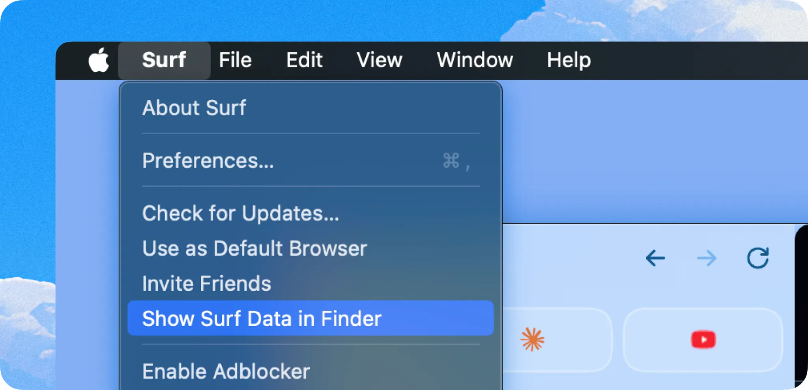

# Library

Breakwind’s foundation is a multi-media library that lives on your computer. You can add many different “resources” to this library: local files, sites from the web, or media created in Breakwind.

Each resource lives on your device in [local and open data formats] through a Rust storage engine called SFFS. Resources can be organized into [Notebooks](/docs/LIBRARY.md#notebooks), their text content is accessible [offline](/docs/LIBRARY.md#offline) and can be used alone or together to power Breakwind’s generative notes.

## Your Library

Whether a website, YouTube video, or file — you can save most kinds of digital “stuff” in Breakwind. In most cases it is as easy as clicking a single button and Breakwind will figure out what it is and save it. Once saved in Breakwind you can **search** for it, organize it into **Notebooks** and use it to generate **Smart Notes.** All the data is stored locally on your machine.

### Adding resources to your Library

Simply click the blue “Breakwind” button from any tab to add it to Breakwind. You can also click on the “media” tab and “Import Files” to add local files into Breakwind.

For each item added into Breakwind, Breakwind will create a local file, database entry, and a vector embedding (if it has a text representation).

### Supported Resources

You can add any file or web page into Breakwind. There is special support for the following types, where Breakwind will recognize the type:

**Files:**

- PDFs (full text embedding)
- Images (automatic OCR)

**Webpages:**

- YouTube videos
- Tweets
- Reddit Posts
- Articles & Blog Posts
- Notion Documents
- Google Documents
- Slack Messages

### Finding & organizing resources

From any new tab or notebook, you can navigate by notes & media. Right clicking any resource gives you options to manage the resource. You can search from any new tab for resources in your library. You can organize groups of resources in Notebooks.

## Notebooks

**Notebooks** are containers for digital media. They can help you organize your digital life — but can also power Breakwind's AI features!

### Adding & Removing Items from Notebooks

When adding something to Breakwind via the “Breakwind” button, you can also select an individual notebook to add it to. You can right click any item from any notebook, and remove it from the said notebook.

### Tips

You can right click any notebook and scribble to customize its cover.

## Data Ownership

The data Breakwind stores is saved fully on your device. This includes a local files, a local database, and local embeddings. The only time this data leaves your computer is when using AI powered features like Smart Notes with a hosted AI model. If you want you can configure Breakwind to use a local model.

You can view all the data that Breakwind is storing on your computer by selecting “Show Breakwind Data in Finder/Explorer” from the Breakwind menu:

For any individual item, you can click the ‘…’ menu and click “View in Finder / Explorer” to see the individual file associated with resource you are viewing in Breakwind.

## Offline Support

Once items are added to your Library in Breakwind, you can view them offline (if they have a text representation). Click the “…” menu or right click any resource and click “View Offline Version”.
